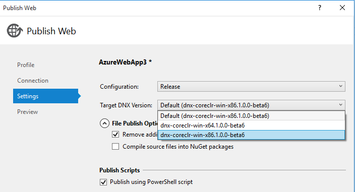

# Known issues for ASP.NET 5 support in Visual Studio 2015

## ASP.NET 5 Beta8

Here are the known issues with ASP.NET 5 Beta8

#### ComponentModelCache needs to be cleared

Visual Studio caches some of it's internal state in the `ComponentModelCache` folder. In some cases this cache may be invalidated, but not updated correctly. The result is that you may run into a number of errors which cannot be explained directly.

For example any of the following error messages could indicate an issue with an invalid `ComponentModelCache`.

```
System.ArgumentException: Item has already been added. Key in dictionary: 'RazorSupportedRuntimeVersion'
```

```
    This project is incompatible with the current edition of Visual Studio:

    Microsoft Visual Studio Community 2015 Version 14.0.23107.0 D14REL
    Microsoft .NET Framework
    Version 4.6.00079

```

**Workaround**

To work around this.

 1. Close all instances of Visual Studio
 2. Delete the folder at `%localappdata%\Microsoft\VisualStudio\14.0\ComponentModelCache`
 3. Restart Visual Studio

#### Issues with NuGet

If you experience any issues with NuGet packages not being resolved, or being resolved to unexpected versions. The best thing to try install the latest version of NuGet from https://visualstudiogallery.msdn.microsoft.com/5d345edc-2e2d-4a9c-b73b-d53956dc458d/file/146283/8/NuGet.Tools.vsix.

Some examples off issues that may be resolved by updating NuGet are below.

 - NuGet feed for nuget.org is disabled
 - Package restore returns `beta8` packages instead of `beta5` packages

#### System beep on stop debugging

With ASP.NET 5 Beta8 we have changed how web applications are hosted with the Visual Studio debugger. In this release when you stop debugging you may notice there is a system beep that occurs at the end of debugging. This is a known issue that should be fixed with the first update for Visual Studio 2015 itself. The only workaround is to disable system sounds for this release. There is no functional impact.

## ASP.NET 5 Beta6

#### First F5 with IIS Express may not work

Sometimes, after you create an ASP.NET Web Application project for the first time, when you hit F5 for the first time, iisexpress.exe will exit with error code 666.


**Workaround**

If you run into this error you should be able to hit F5 again to get the project to launch correctly.

#### Access Denied when installing DNX runtime using DNVM

In some cases, when creating an ASP.NET 5 project, DNVM fails to install the DNX runtime, and you will see the following error in the DNVM log:

```
Installing to C:\Users\balach\.dnx\runtimes\dnx-clr-win-x86.1.0.0-beta6
Move-Item : Access to the path 'C:\Users\balach\.dnx\runtimes\temp\dnx-clr-win-x86.1.0.0-beta6' is denied.
At C:\Program Files\Microsoft DNX\Dnvm\dnvm.ps1:1156 char:17
+                 Move-Item $UnpackFolder $RuntimeFolder
+                 ~~~~~~~~~~~~~~~~~~~~~~~~~~~~~~~~~~~~~~
    + CategoryInfo          : WriteError: (C:\Users\balach...x86.1.0.0-beta6:DirectoryInfo) [Move-Item], IOException
    + FullyQualifiedErrorId : MoveDirectoryItemIOError,Microsoft.PowerShell.Commands.MoveItemCommand

Cannot find dnx-clr-win-x86.1.0.0-beta6, do you need to run 'dnvm install 1.0.0-beta6'?
At C:\Program Files\Microsoft DNX\Dnvm\dnvm.ps1:1268 char:9
+         throw "Cannot find $runtimeFullName, do you need to run '$Com ...
+         ~~~~~~~~~~~~~~~~~~~~~~~~~~~~~~~~~~~~~~~~~~~~~~~~~~~~~~~~~~~~~
    + CategoryInfo          : OperationStopped: (Cannot find dnx...l 1.0.0-beta6'?:String) [], RuntimeException
    + FullyQualifiedErrorId : Cannot find dnx-clr-win-x86.1.0.0-beta6, do you need to run 'dnvm install 1.0.0-beta6'?

Installing to C:\Users\balach\.dnx\runtimes\dnx-coreclr-win-x86.1.0.0-beta6
Adding C:\Users\balach\.dnx\runtimes\dnx-coreclr-win-x86.1.0.0-beta6\bin to process PATH
Compiling native images for dnx-coreclr-win-x86.1.0.0-beta6 to improve startup performance...
```

**Workaround**

Restart Visual Studio and try creating the project again. DNVM should succeed this time.

#### For a project targeting only CoreCLR (dnxcore50), you could run into a failure during Publish

If you update your ASP.NET 5 web project to target only CoreCLR (only dnxcore50 in project.json), you might run into the following failure when you try to Publish with the default Publish settings.

```
The "Dnu" task failed unexpectedly.
The project being published does not support the runtime 'dnx-clr-win-x86.1.0.0-beta6'
```

**Workaround**

In the Settings tab of the Publish dialog, explicitly select dnx-coreclr as the target rather than using the 'Default'. See the image below.



## ASP.NET Beta5 / Visual Studio 2015 RTM

## Visual Studio 2015 RC

#### applicationHost.config file appears as an untracked file in Solution

The applicationHost.config file will sometimes appear as an untracked file in Solution Explorer. This file should not be checked in as it has user specific paths which will not work in team environments.

#### Removing dnx451 from project.json frameworks may lead to erroneous build errors for ASP.NET 5 Web Sites projects

If you remove the dnx451 value from the frameworks section in project.json for ASP.NET 5 Web Site projects you may receive an error similar to "The type or namespace name 'AspNet' does not exist in the namespace 'Microsoft' (are you missing an assembly reference?)". To work around this you can remove the file at Compiler\Preprocess\RazorPreCompilation.cs.

#### Unable to add a reference to a standard C# project (.csproj) from an ASP.NE T 5 project which is missing global.json

If you are working in a solution with ASP.NET 5 projects that does not have a global.json file you may not be able to add a reference to a standard C# project (.csproj) from an ASP.NET 5 project.

#### Installing dnvm x64 CoreClr without installing the corresponding x86 version may cause errors

If you install an x64 CoreClr version of dnvm and use that as the default then you may get error message like "Cannot find the DNX runtime '<version>' … ". To work around this install the corresponding x86 version as well.

#### Publishing using Web Express may incorrectly report a failed status

When publishing using Visual Studio 2015 Web Express you may receive an error like "The InstallDir property does not exist in the path HKEY_LOCAL_MACHINE\SOFTWARE\ Wow6432Node\Microsoft\VisualStudio\14.0." Even though this error is reported in most cases the site is actually published.

#### IntelliSense for version in bower.json may not work on localized builds

If you are using a localized version of Visual Studio 2015 IntelliSense for version of bower packages may not work in bower.json.
